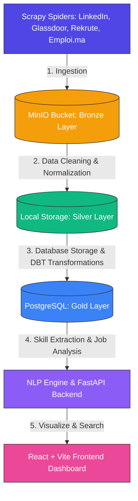

# Job-Intelligent 🚀
An end-to-end intelligent Job Market Ingestion, processing, and visualization system. This platform uses the **Medallion Architecture** to crawl job boards, store raw JSON data in Object Storage, refine it, load it into PostgreSQL, perform DBT transformations, analyze descriptions via an NLP engine, and display the matching offers on a React frontend dashboard.

---

## 🏗️ Architecture & Data Pipeline

The project follows a standard Medallion Architecture managed by Apache Airflow:



1. **Bronze Layer (Ingestion)**: Job boards are scraped using Scrapy Spiders. The raw, nested JSON payloads are stored directly in **MinIO** object storage.
2. **Silver Layer (Processing)**: Python cleaning scripts handle deduplication, standardizing salary figures, and schema alignment.
3. **Gold Layer (Refinement & Modeling)**: Cleaned data is ingested into **PostgreSQL**. **DBT** runs transformations on this relational data to model business-ready analytics and metrics.
4. **NLP Engine**: A backend service parses the job descriptions to extract required skills, matching scores, and categories.
5. **Dashboard**: Users search and view the processed jobs in a clean, modern React app.

---

## 📂 Project Structure

```text
job-intelligent/
├── docker/
│   ├── docker-compose.yml
│   └── data/
│       ├── minio/
│       └── postgres/
├── services/
│   ├── airflow/
│   │   └── dags/
│   │       └── scraper_dag.py
│   ├── dbt/
│   ├── etl/
│   └── scrapers/
│       ├── items.py
│       ├── pipeline.py
│       ├── minioPipeline.py
│       ├── settings.py
│       ├── run_all.py
│       ├── count_jobs.py
│       ├── format_jobs.py
│       ├── international/
│       │   ├── apec.py
│       │   ├── france_travail.py
│           ├── linkedin.py
│       │   └── glassdoor.py
│       └── morocco/
│           ├── emploi.py
│           └── rekrute.py
├── backend/
│   ├── main.py
│   ├── models.py
│   └── nlp_engine.py
├── frontend/
│   └── src/
├── scrapy.cfg
└── Readme.md
```

---

## 🚀 Setup & Execution Guide

Use the following commands to initialize and run the ecosystem from scratch, or for troubleshooting.

### 1. Initialize Apache Airflow Metadata
To initialize the schema and tables in PostgreSQL for Apache Airflow (stores DAG configurations, task runs, logs, and metadata):
```bash
docker compose run --rm airflow-webserver db init
```

### 2. Create the Airflow Admin User
Generate your administrative account for the Apache Airflow Web UI:
```bash
docker compose run --rm airflow-webserver users create --username admin --firstname Admin --lastname Admin --role Admin --email admin@example.com --password admin
```

### 3. Spin Up the Database Container
Run the dedicated Airflow database service in the background:
```bash
docker compose up -d airflow-db
```

### 4. Initialize Airflow Workspace & Configuration
Execute the initialization container to prepare the directory structures and environments:
```bash
docker compose run airflow-init
```

### 5. Launch / Update the Entire Stack
Build, update, and run all core services (Airflow, MinIO, PostgreSQL, Scrapers, Backend, Frontend) in detached mode:
```bash
docker compose --env-file .env -f docker/docker-compose.yml up -d
```

### 6. Verify and Check Configurations
To debug environment issues or review the compiled configuration file:
```bash
docker compose --env-file .env -f docker/docker-compose.yml config
```
