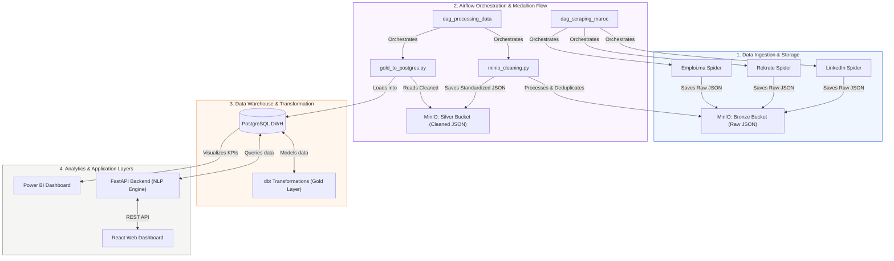

# Job-Intelligent 🚀

**Job-Intelligent** is a modern, end-to-end Big Data & AI pipeline for job market analysis and candidate matching. The system crawls job listings from multiple platforms, ingests them into a Data Lake, refines the data using a Medallion Architecture, runs transformations in a PostgreSQL Data Warehouse, utilizes a Python NLP engine for smart matching, and visualizes insights via Power BI and a React web application.

---

## 🛠️ Technology Stack & Tools

*   **Data Collection / Crawling**: `Python`, `Scrapy` (Custom spiders for LinkedIn, Rekrute.ma, and Emploi.ma).
*   **Data Lake (Object Storage)**: `MinIO` (S3-compatible, hosting the Bronze and Silver Medallion layers).
*   **Orchestration**: `Apache Airflow` (Managing ingestion, data cleaning, and Postgres loading pipelines).
*   **Data Warehouse**: `PostgreSQL` (Relational analytical warehouse with star schema modeling).
*   **Data Transformation**: `dbt (Data Build Tool)` (Transforming raw relational data into Gold-standard business tables).
*   **Intelligence Engine**: `FastAPI` (REST API) + custom `Python NLP Engine` (CV parsing, skill matching, score calculation).
*   **User Interface / Frontend**: `React + Vite` (TypeScript dashboard for job search, CV uploads, and matching analytics).
*   **Business Intelligence / Analytics**: `Power BI` (Connected to PostgreSQL for tracking market KPIs, top skills, and hiring trends).
*   **Infrastructure**: `Docker & Docker Compose` (Complete multi-container configuration for reproducible environments).

---

## 🏗️ Architecture & Data Pipeline Flow



### The Medallion Data Pipeline Stages:
1.  **Bronze (Raw Data Ingestion)**: Scrapy Spiders crawl job postings from LinkedIn, Rekrute.ma, and Emploi.ma. The raw nested JSON outputs are uploaded automatically to the **MinIO Bronze Bucket**.
2.  **Silver (Cleaned & Structured Data)**: The Airflow-managed `minio_cleaning.py` script runs to validate formats, remove duplicates, filter out missing fields, and standardize data schemas before writing it back to the **MinIO Silver Bucket**.
3.  **Gold (Warehouse Analytics & Modeling)**: The refined JSON files are loaded into **PostgreSQL** using `gold_to_postgres.py`. **dbt (Data Build Tool)** then models this data into a star schema containing facts and dimensions optimized for reporting.
4.  **Analytics & Machine Learning**:
    *   **Power BI** dashboards track job source distribution, regional demands, and target skills.
    *   A candidate uploads a CV to the **React App**, which communicates with the **FastAPI NLP Engine** to parse skills, compute job similarity, and serve intelligent recommendations.

---

## 📂 Project Structure

```text
job-intelligent/
├── docker/
│   ├── docker-compose.yml          # Services definition (Postgres, MinIO, Airflow, Backend, Frontend)
│   └── data/
│       ├── minio/                  # Local storage mount for MinIO
│       └── postgres/               # Local storage mount for PostgreSQL
├── services/
│   ├── airflow/
│   │   ├── dags/
│   │   │   ├── dag_scraping.py     # Orchestrates Scrapy tasks
│   │   │   └── dag_processing.py   # Orchestrates Medallion transformation tasks
│   │   └── Dockerfile
│   ├── dbt/                        # dbt SQL models for database transformation
│   ├── etl/
│   └── scrapers/                   # Scrapy Spiders
│       ├── settings.py
│       ├── run_all.py
│       ├── international/
│       │   └── linkedin.py         # LinkedIn spider
│       └── morocco/
│           ├── rekrute.py          # Rekrute spider
│           └── emploi.py           # Emploi.ma spider
├── processing/                     # Python scripts used by Airflow
│   ├── minio_cleaning.py           # Ingestion step (Bronze -> Silver)
│   └── gold_to_postgres.py         # Ingestion step (Silver -> Gold DB)
├── backend/                        # Python API layer
│   ├── main.py                     # FastAPI routes
│   ├── models.py                   # SQLAlchemy models
│   └── nlp_engine.py               # Resume parsing & scoring engine
├── frontend/                       # React Web Client
│   ├── src/                        # Core views, components, and hooks
│   └── package.json
├── scrapy.cfg                      # Scrapy settings configuration
└── Readme.md
```

---

## 🚀 Setup & Execution Guide (From First Import)

Follow these steps chronologically to set up and run the project from scratch on your local machine.

### Step 1: Clone the Project and Open Terminal
Clone your repository and navigate to the project directory:
```bash
git clone <your-repository-url>
cd job-intelligent
```

### Step 2: Configure Environment Variables
Copy the template `.env.example` file to create your local `.env` configuration file:
```bash
cp .env.example .env
```
*(Open the newly created `.env` file and verify or change passwords/secret keys if needed).*

### Step 3: Initialize PostgreSQL Database for Airflow
Before starting Airflow services, you must initialize the required backend schema and tables inside PostgreSQL:
```bash
docker compose run --rm airflow-webserver db init
```

### Step 4: Create Airflow Admin User
Generate your administrative account to access the Apache Airflow Web GUI interface:
```bash
docker compose run --rm airflow-webserver users create --username admin --firstname Admin --lastname Admin --role Admin --email admin@example.com --password admin
```

### Step 5: Start the Airflow Database
Run the designated Airflow database service in the background:
```bash
docker compose up -d airflow-db
```

### Step 6: Initialize Airflow Workspace Directories
Execute the initialization container to prepare the directory structures and environment workspace configurations:
```bash
docker compose run airflow-init
```

### Step 7: Launch the Entire Project Stack
Build, update, and run all core application services (Airflow, MinIO, PostgreSQL, Scrapers, Backend, Frontend) in detached background mode:
```bash
docker compose --env-file .env -f docker/docker-compose.yml up -d
```

### Step 8: Verify Configurations & Service Status
To verify the environment configurations or review active docker instances:
```bash
# Verify config compile:
docker compose --env-file .env -f docker/docker-compose.yml config

# Check running containers:
docker compose ps
```

---

## 🔗 Accessible URLs
Once the services are running, you can access the different components of the platform locally:

*   **React Frontend Dashboard**: `http://localhost:5173`
*   **FastAPI Backend & API Docs**: `http://localhost:8000/docs`
*   **Apache Airflow Web UI**: `http://localhost:8080` (Credentials: `admin` / `admin`)
*   **MinIO Console (Data Lake)**: `http://localhost:9001` (Credentials: `minioadmin` / `miniopassword`)
